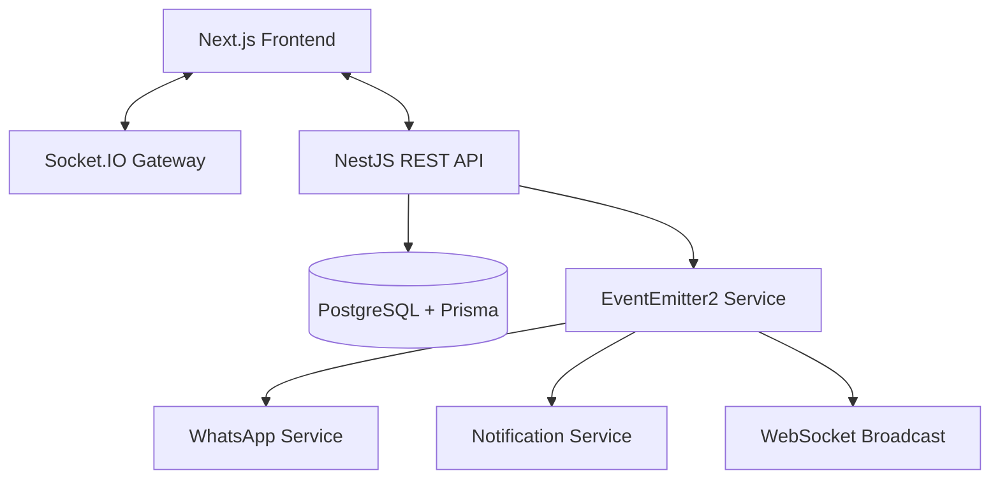

# System Architecture — EduTrack ERP

EduTrack is designed with a modern, scalable, and decoupled architecture that prioritizes real-time interactivity and automated workflows.

## 🏗️ High-Level Overview

---

## 💻 Frontend Architecture

The frontend is built with **Next.js 16** (App Router) and **TypeScript**, emphasizing a modular component structure and centralized state management.

### Tech Stack
- **Framework**: Next.js 16 (App Router)
- **Styling**: Tailwind CSS v4
- **Components**: shadcn/ui + Radix UI
- **State Management**: Zustand
- **Real-time**: Socket.IO Client
- **Charts**: Recharts
- **Animations**: Framer Motion

### Directory Structure
- `src/app`: Routes and Page components.
- `src/components`: UI primitives and feature-specific components.
- `src/store`: Zustand stores for Auth, Socket, and Sidebar state.
- `src/services`: API client wrappers for various modules.
- `src/hooks`: Custom React hooks for business logic.

---

## ⚙️ Backend Architecture

The backend is a **NestJS** micro-framework based API, following a modular design pattern.

### Tech Stack
- **Framework**: NestJS
- **ORM**: Prisma
- **Database**: PostgreSQL
- **Security**: JWT, Passport.js, Bcrypt, Helmet, Throttler
- **Messaging**: EventEmitter2
- **Storage**: Cloudinary

### Key Design Patterns
1.  **Modular Monolith**: Each feature (Students, Attendance, Fees) is a self-contained module.
2.  **Event-Driven Workflows**: Core services emit events (e.g., `payment.received`) which are consumed by listeners for secondary actions like sending WhatsApp receipts.
3.  **Real-time Synchronization**: A WebSocket gateway integrates with internal events to push instant UI updates.

---

## 🔄 Real-time & Event Flow

### WebSocket Integration
The `AppGateway` handles authenticated WebSocket connections. When a backend event occurs:
1.  A service emits an event via `EventEmitter2`.
2.  The `SocketListener` catches the event.
3.  The gateway broadcasts to specific rooms (`admins`, `user_id`).
4.  The frontend receives the event and updates the Zustand store or triggers a toast.

### WhatsApp Automation Flow
1.  **Trigger**: User marks a student as "Absent".
2.  **Event**: `attendance.absent` is emitted.
3.  **Listener**: `WhatsAppListener` receives the event.
4.  **Template**: Fetches the "ATTENDANCE_ABSENT" template from the DB.
5.  **Delivery**: Sends the formatted message via the Meta WhatsApp API service.

---

## 🔒 Security & Performance

- **Authentication**: Stateless JWT-based auth with Role-Based Access Control (RBAC).
- **Rate Limiting**: Throttler guards protect against brute-force and API abuse.
- **Data Safety**: Strict DTO validation using `class-validator` and `class-transformer`.
- **Performance**: Optimized database queries via Prisma indexes and selective includes.
